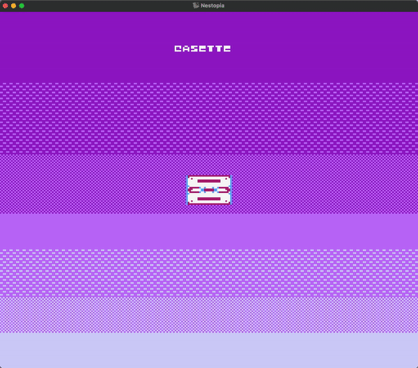

# 💜 [**Cassette**](cassette.asm) 💜

Some cute NES art for practice.

**Figure 1**: Current progress. Download the ROM [**here**](cassette.nes).

### Usage

- **🕹️**: Move Up, Down, Left, and Right
- **🅰️**: Change Cassette Palette